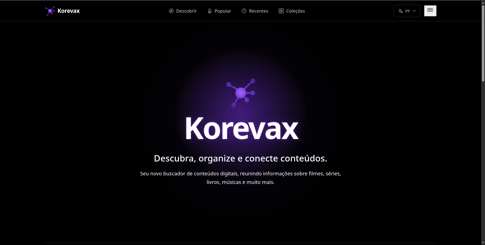

# Korevax

> **Korevax is an open-source ecosystem for discovering, organizing, connecting and exploring digital content.**

O **Korevax** é um ecossistema open-source voltado à descoberta, organização, conexão e exploração de conteúdos digitais.

O projeto busca criar uma estrutura fundamentada em **dados organizados, relações entre entidades, comunidade e interoperabilidade**, permitindo que diferentes tipos de conteúdo sejam catalogados e relacionados dentro de um mesmo ecossistema.

   

---

## 1. Visão

O Korevax nasceu da ideia de construir uma estrutura básica e aberta que possa servir como fundamento para diferentes aplicações relacionadas a conteúdo digital.

A proposta não é simplesmente criar uma lista de filmes, livros ou músicas. O objetivo é construir uma **infraestrutura de informação**, capaz de representar conteúdos, pessoas, organizações, personagens e seus relacionamentos.

### Princípios

O desenvolvimento do Korevax prioriza:

* Arquitetura
* Organização
* Responsividade
* Segurança
* Integridade dos dados
* Escalabilidade
* Internacionalização
* Interoperabilidade
* Contribuição comunitária

---

# 2. Objetivo

O Korevax pretende facilitar:

* descoberta de conteúdos;
* organização de catálogos;
* pesquisa de informações;
* relacionamento entre entidades;
* análise de metadados;
* preservação de informações sobre conteúdos antigos e novos;
* contribuição comunitária;
* utilização dos dados por outras aplicações.

A plataforma deve ser capaz de trabalhar com diferentes categorias de conteúdo sem depender de uma estrutura específica para cada tipo.

---

# 3. Conteúdos

O catálogo pode abranger diferentes tipos de conteúdo.

Entre eles:

* Filmes
* Séries
* Animações
* Animes
* Livros
* Mangás
* Manhwas
* Músicas
* Podcasts
* Jogos
* Documentários

A arquitetura deve permitir a adição de novos tipos de conteúdo sem exigir uma reconstrução completa do sistema.

---

# 4. Catálogo

O catálogo é uma das partes fundamentais do Korevax.

Cada conteúdo pode possuir informações estruturadas, como:

* título;
* títulos alternativos;
* descrição;
* capa;
* ano;
* gêneros;
* idiomas;
* país ou região;
* identificadores externos;
* relações com outras entidades;
* avaliações;
* resenhas;
* informações adicionais.

A quantidade e o tipo de informações podem variar conforme a categoria do conteúdo.

Por exemplo, uma série pode possuir temporadas e episódios, enquanto um livro pode possuir autores, edições e traduções.

---

# 5. Pesquisa e descoberta

O Korevax deve permitir que usuários encontrem conteúdos por diferentes métodos.

Exemplos:

* pesquisa por título;
* pesquisa por pessoa;
* pesquisa por personagem;
* pesquisa por gênero;
* pesquisa por categoria;
* pesquisa por idioma;
* pesquisa por relações;
* filtros combinados.

A descoberta também pode utilizar as relações existentes no Knowledge Graph.

---

# 6. Knowledge Graph

O **Knowledge Graph** é um dos conceitos centrais do Korevax.

Em vez de tratar cada conteúdo como uma informação isolada, o sistema representa entidades e seus relacionamentos.

Por exemplo:

```text
Person
   │
   └── portrays ──> Character
```

Ou:

```text
Person
   │
   ├── founded ──> Organization
   │
   └── member_of ──> Organization
```

A estrutura permite conectar informações que normalmente ficariam separadas.

---

## 6.1 Entidades

Algumas entidades previstas incluem:

* Person
* Character
* Organization
* Content
* Movie
* Series
* Book
* Music
* Game
* Podcast

As entidades específicas podem posteriormente herdar características de entidades mais gerais.

---

## 6.2 Relações

As relações devem possuir **origem e destino semanticamente claros**.

Relações inicialmente definidas:

| Origem | Relação   | Destino      |
| ------ | --------- | ------------ |
| Person | portrays  | Character    |
| Person | founded   | Organization |
| Person | member_of | Organization |

A intenção é evitar relações genéricas ou ambíguas.

Por exemplo, uma relação como:

```text
Person → works_for → Organization
```

não deve ser adicionada simplesmente por conveniência.

Ela só deve existir quando houver uma necessidade concreta e uma definição semântica suficientemente clara.

---

# 7. Metadados

O Korevax deve trabalhar com metadados estruturados e verificáveis.

Os metadados podem possuir:

* origem;
* identificador;
* data de atualização;
* entidade relacionada;
* fonte;
* nível de confiança;
* histórico de alterações.

A integridade das informações é importante porque diferentes fontes podem apresentar dados conflitantes.

O sistema deve ser projetado para **armazenar e representar informações**, e não assumir automaticamente que toda informação encontrada é verdadeira.

---

# 8. Validação

O projeto prevê mecanismos de validação para reduzir informações incorretas ou inconsistentes.

A validação pode envolver:

* fontes externas;
* regras estruturais;
* validação automática;
* agentes de IA;
* revisão comunitária;
* moderadores.

A IA pode auxiliar no processo, mas não deve ser tratada como uma autoridade absoluta.

> **Korevax is not an AI authority.**

Agentes de IA devem atuar como ferramentas auxiliares de pesquisa, comparação e validação.

---

# 9. Agentes de IA

O Korevax poderá utilizar agentes especializados para tarefas como:

* pesquisa de conteúdos;
* descoberta de informações;
* comparação de fontes;
* identificação de possíveis inconsistências;
* validação de dados;
* auxílio na organização do catálogo.

Esses agentes devem produzir resultados que possam ser analisados e, quando necessário, revisados por humanos.

---

# 10. Comunidade

A comunidade possui papel importante na evolução do catálogo.

Usuários e contribuidores poderão participar de atividades como:

* avaliação de conteúdos;
* criação de resenhas;
* correção de informações;
* identificação de problemas;
* contribuição de metadados;
* criação ou atualização de relações;
* denúncias de informações incorretas.

O sistema deve distinguir claramente entre:

**dados estruturados do catálogo**

e

**opiniões ou contribuições da comunidade.**

---

# 11. Avaliações e resenhas

O Korevax poderá permitir que usuários avaliem conteúdos e escrevam resenhas.

Essas informações devem ser tratadas como dados produzidos pela comunidade, e não como propriedades objetivas do conteúdo.

Exemplo:

```text
Content
 ├── rating
 └── reviews
```

As avaliações podem posteriormente ser agregadas de acordo com regras definidas pelo sistema.

---

# 12. Internacionalização

O Korevax deve ser projetado desde o início para suportar múltiplos idiomas.

A interface deve separar:

* textos da aplicação;
* dados do catálogo;
* idiomas disponíveis;
* traduções;
* configurações regionais.

Na interface web, o idioma pode ser selecionado através de um dropdown.

Exemplo:

```text
🇧🇷 PT-BR — Português
🇺🇸 ENG — English
```

As traduções podem ser armazenadas em arquivos estruturados, como JSON, permitindo adicionar novos idiomas sem alterar diretamente os componentes da interface.

---

# 13. Interface Web

A aplicação web utiliza uma arquitetura baseada em componentes.

O frontend atual está sendo desenvolvido com:

* React
* TypeScript
* Vite
* Ionic React
* Ionicons
* CSS

A interface deve ser responsiva e funcionar em:

* desktop;
* tablet;
* dispositivos móveis.

---

# 14. Header

O Header é estruturado como um componente independente.

A navegação principal prevista contém:

* Descobrir
* Popular
* Recentes
* Coleções

Também existem ações relacionadas ao:

* idioma;
* menu mobile;
* navegação responsiva.

No desktop, a navegação fica integrada ao Header.

No mobile, parte da navegação é transferida para um menu específico.

---

# 15. Estrutura do frontend

A organização busca manter os componentes independentes e reutilizáveis.

Exemplo simplificado:

```text
src/
├── components/
│   └── Header/
│       ├── Header.tsx
│       ├── Header.css
│       │
│       ├── Actions/
│       │   ├── Actions.css
│       │   ├── LanguageDropdown/
│       │   └── MobileMenuButton/
│       │
│       └── MobileNavigation/
│
├── config/
│   └── languages.ts
│
├── locales/
│
├── services/
│   └── i18n.ts
│
└── styles/
    └── variables.css
```

A estrutura pode evoluir conforme novas funcionalidades forem adicionadas.

---

# 16. Design

A identidade visual inicial utiliza uma paleta limitada a:

* preto;
* branco;
* roxo.

As variáveis visuais ficam centralizadas para facilitar manutenção e evolução do design.

A interface deve priorizar:

* clareza;
* consistência;
* acessibilidade;
* responsividade;
* baixo acoplamento entre componentes.

---

# 17. Arquitetura

O Korevax deve evitar uma arquitetura baseada em milhares de páginas HTML criadas manualmente.

Por exemplo, em vez de criar:

```text
/movie/filme-1.html
/movie/filme-2.html
/movie/filme-3.html
...
```

a aplicação pode utilizar componentes e dados dinâmicos:

```text
/content/:id
```

O mesmo componente pode então representar diferentes entidades a partir dos dados recebidos.

Isso facilita:

* manutenção;
* escalabilidade;
* internacionalização;
* reutilização;
* atualização dos dados.

---

# 18. API

O Korevax deverá possuir APIs para permitir acesso aos dados do ecossistema.

Possíveis consumidores:

* aplicação web;
* aplicativos desktop;
* aplicativos mobile;
* projetos de terceiros;
* ferramentas de pesquisa;
* outros projetos open-source.

A API deve respeitar as mesmas regras de integridade e segurança aplicadas ao restante do sistema.

---

# 19. Segurança

Segurança é um dos princípios fundamentais do projeto.

Alguns pontos importantes incluem:

* validação de entrada;
* autenticação segura;
* autorização baseada em permissões;
* proteção contra abuso;
* proteção de APIs;
* controle de acesso;
* armazenamento seguro de credenciais;
* tratamento adequado de dados fornecidos por usuários;
* auditoria de alterações;
* prevenção contra manipulação indevida do catálogo.

Nenhuma informação recebida de usuários ou fontes externas deve ser considerada confiável por padrão.

---

# 20. Integridade dos dados

O Korevax deve priorizar a integridade do catálogo.

Isso significa que alterações importantes podem precisar de:

1. identificação da informação;
2. identificação da fonte;
3. validação;
4. registro da alteração;
5. possibilidade de auditoria.

O objetivo é evitar que uma simples edição destrua o histórico ou a confiabilidade de uma entidade.

---

# 21. Escalabilidade

A arquitetura deve permitir que o projeto cresça gradualmente.

A escalabilidade deve ser considerada em diferentes níveis:

### Frontend

Componentes reutilizáveis e carregamento eficiente.

### Backend

Serviços independentes e APIs bem definidas.

### Banco de dados

Modelo preparado para grandes quantidades de entidades e relações.

### Knowledge Graph

Estrutura capaz de representar relações complexas sem depender de estruturas rígidas.

### Comunidade

Sistema de contribuições e moderação capaz de crescer junto com a quantidade de usuários.

---

# 22. Open Source

O Korevax é um projeto open-source.

A intenção é permitir que desenvolvedores possam:

* estudar o projeto;
* contribuir;
* criar extensões;
* utilizar APIs;
* construir aplicações derivadas;
* propor melhorias;
* desenvolver integrações.

O projeto deve manter documentação suficiente para que novos contribuidores compreendam sua arquitetura e seus conceitos.

---

# 23. GitHub

O projeto utiliza uma organização própria no GitHub:

```text
Korevax
```

A organização serve como espaço central para os diferentes componentes do ecossistema.

A separação de repositórios pode acompanhar responsabilidades distintas, como:

```text
Korevax/
├── web
├── api
├── knowledge-graph
├── documentation
└── ...
```

A estrutura final deve ser definida conforme os componentes realmente forem implementados, evitando criar repositórios prematuramente.

---

# 24. Públicos

O Korevax possui diferentes grupos de usuários.

### Visitantes

Pessoas que apenas procuram e exploram conteúdos.

### Usuários

Pessoas que utilizam recursos como avaliações, resenhas e coleções.

### Contribuidores

Pessoas que ajudam a melhorar o catálogo e o projeto.

### Moderadores

Responsáveis por analisar contribuições e problemas dentro da comunidade.

### Desenvolvedores

Pessoas que trabalham diretamente no software.

### Pesquisadores

Pessoas interessadas nos dados, relações e informações disponibilizadas pelo ecossistema.

### Desenvolvedores de terceiros

Pessoas ou organizações que utilizam as APIs ou constroem aplicações sobre o Korevax.

---

# 25. O que o Korevax não é

O Korevax possui algumas fronteiras conceituais importantes.

## Não é um serviço de hospedagem de arquivos

O objetivo é catalogar, organizar e relacionar informações sobre conteúdo.

O Korevax não tem como objetivo hospedar ou distribuir arquivos de mídia.

## Não é uma autoridade de IA

A inteligência artificial pode auxiliar na pesquisa e validação, mas não deve ser considerada uma fonte absoluta de verdade.

## Não é apenas um catálogo

Embora o catálogo seja fundamental, a proposta envolve também:

* relações;
* dados estruturados;
* APIs;
* comunidade;
* conhecimento;
* interoperabilidade.

---

# 26. Ecossistema

O conceito central é que o Korevax funcione como uma **estrutura fundamental sobre a qual diferentes aplicações podem ser construídas**.

A ideia pode ser representada assim:

```text
                    KOREVAX
                       │
        ┌──────────────┼──────────────┐
        │              │              │
     Catálogo      Knowledge       Community
        │            Graph             │
        │              │              │
        └──────────────┼──────────────┘
                       │
                      API
                       │
          ┌────────────┼────────────┐
          │            │            │
        Web          Mobile      Third-party
                                  Apps
```

O objetivo é permitir que o Korevax seja mais do que uma aplicação isolada: uma base aberta para diferentes formas de exploração e utilização de conteúdo digital.

---

# 27. Estado atual

O desenvolvimento atual está concentrado na construção da base do frontend e na definição dos conceitos fundamentais do projeto.

Já foram definidos ou explorados:

* identidade Korevax;
* organização GitHub;
* visão do projeto;
* estrutura inicial do frontend;
* Header;
* navegação;
* menu mobile;
* dropdown de idiomas;
* internacionalização inicial;
* sistema de componentes;
* princípios de design;
* conceitos do Knowledge Graph;
* relações iniciais entre entidades;
* princípios de segurança e integridade.

A implementação do backend, catálogo completo, API e Knowledge Graph poderá evoluir posteriormente sobre essa base.

---

# 28. Princípio geral

O Korevax deve crescer de maneira incremental.

Em vez de tentar implementar todo o ecossistema simultaneamente, cada camada deve possuir uma definição clara e uma responsabilidade específica.

Uma possível evolução:

```text
Fundação
   ↓
Frontend
   ↓
Modelo de dados
   ↓
Catálogo
   ↓
API
   ↓
Knowledge Graph
   ↓
Comunidade
   ↓
Agentes de IA
   ↓
Ecossistema
```

Cada etapa deve preservar os princípios estabelecidos anteriormente.

---

# 29. Resumo

**Korevax** é um ecossistema open-source para descobrir, organizar, conectar e explorar conteúdo digital.

Seu núcleo é formado por:

```text
Conteúdo
   +
Dados
   +
Entidades
   +
Relações
   +
Comunidade
   +
APIs
```

O projeto busca criar uma estrutura aberta, organizada, segura e escalável que possa servir tanto para usuários finais quanto para desenvolvedores, pesquisadores e outros projetos.

> **Korevax — an open-source ecosystem for discovering, organizing, connecting and exploring digital content.**
